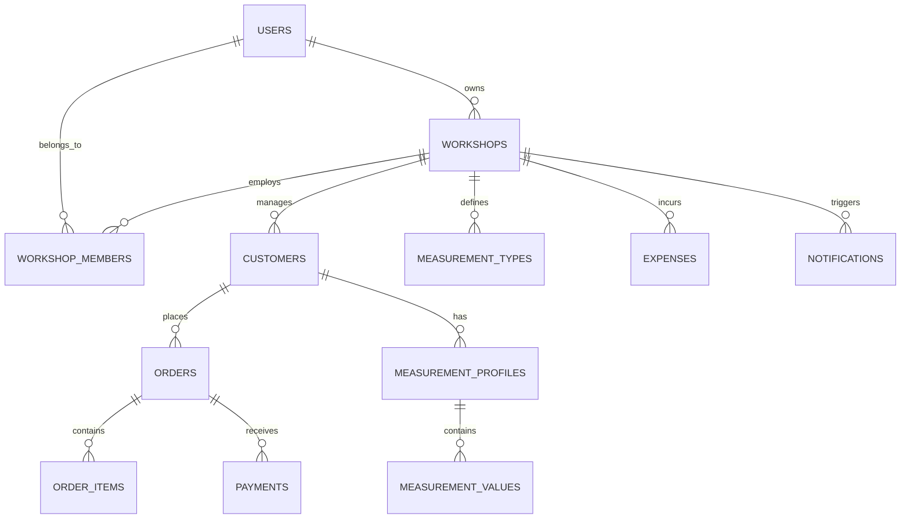

# GEMINI.md — Project Intelligence & AI Development Guide

Last analyzed: 2026-09-07  
Project: AtelierPro (`atelierpro`)

> This document is the persistent technical memory of this project.  
> Any AI agent working on this repository should read this document before making architectural or significant code changes.

---

## 1. PRÉSENTATION DU PROJET

- **Nom de l'application** : AtelierPro (SaaS de Haute Confection & Gestion d'Ateliers de Couture en Afrique)
- **Objectif principal** : Digitaliser et simplifier la gestion opérationnelle complète des ateliers de couture, maîtres tailleurs, modélistes et maisons de mode en Afrique subsaharienne (Sénégal, Côte d'Ivoire, Mali, Guinée, etc.).
- **Problèmes résolus** :
  - Disparition et dégradation des carnets de mesures papier physiques.
  - Litiges récurrents sur les mensurations et les gabarits de confection (Grand Boubou, Kaftan, Robes, etc.).
  - Retards de livraison et goulots d'étranglement dans le suivi du travail des apprentis et couturiers.
  - Impayés et difficultés de recouvrement des acomptes et des soldes à la livraison.
  - Gestion archaïque des règlements en espèces sans traçabilité des paiements Mobile Money (Wave, Orange Money).
- **Utilisateurs ciblés** :
  - Maîtres tailleurs et propriétaires d'ateliers (`OWNER`).
  - Responsables de production et gérants d'ateliers (`MANAGER`).
  - Couturiers, coupeurs et apprentis (`TAILOR`, `CUTTER`, `CASHIER`, `EMPLOYEE`).
  - Clients finaux (réception de reçus WhatsApp, notifications de livraison, factures PDF).
- **Fonctionnement général** :
  - Application Web moderne & Progressive Web App (PWA installable sur Android/iOS/Desktop) avec mode hors-ligne.
  - Gestion multi-tenant étanche : chaque atelier possède ses propres données isolées (clients, commandes, mesures, finances).
  - Synchronisation en direct avec Supabase (PostgreSQL, Auth, RLS) et persistance locale Zustand (mode démo/offline).
- **Principaux parcours utilisateurs** :
  1. *Acquisition & Vitrine* : Landing page de conversion avec simulateur de rentabilité dynamique, widget d'assistance IA WhatsApp et modal PWA.
  2. *Authentification & Onboarding* : Inscription par email/mot de passe ou Google OAuth, création automatique de l'atelier ou parcours guidé.
  3. *Cycle Client & Mesures* : Création client -> Carnet de mesures spécialisé (gabarits africains avec photo du tissu) -> Fiche client 360°.
  4. *Cycle Commande & Fabrication* : Création commande -> Acompte initial (Wave/OM/Cash) -> Tableau Kanban de production (En attente -> Mesuré -> Coupe -> Couture -> Finition -> Prêt -> Livré).
  5. *Encaissement & WhatsApp* : Enregistrement du solde -> Génération de facture PDF téléchargeable -> Envoi du reçu WhatsApp en 1 clic -> Impression ticket caisse.
- **État actuel du projet** : Application de production fonctionnelle, connectée à Supabase avec Row Level Security, système de paiement Stripe / Mobile Money, PWA installable et déployée sur Vercel (`https://atelier-pro-rose.vercel.app/`).

---

## 2. FONCTIONNALITÉS IMPLÉMENTÉES

### Module 1 : Authentification & Sécurité Multi-Tenant
- **Description** : Inscription, connexion, déconnexion, récupération de mot de passe, synchronisation de session et protection des accès.
- **Fichiers & Pages** : [`app/auth/login/page.tsx`](file:///Users/administrateur/Documents/dossier%20sans%20titre%202/atelierpro/app/auth/login/page.tsx), [`app/auth/register/page.tsx`](file:///Users/administrateur/Documents/dossier%20sans%20titre%202/atelierpro/app/auth/register/page.tsx), [`app/auth/forgot-password/page.tsx`](file:///Users/administrateur/Documents/dossier%20sans%20titre%202/atelierpro/app/auth/forgot-password/page.tsx), [`app/auth/callback/route.ts`](file:///Users/administrateur/Documents/dossier%20sans%20titre%202/atelierpro/app/auth/callback/route.ts), [`components/auth/supabase-auth-sync.tsx`](file:///Users/administrateur/Documents/dossier%20sans%20titre%202/atelierpro/components/auth/supabase-auth-sync.tsx), [`middleware.ts`](file:///Users/administrateur/Documents/dossier%20sans%20titre%202/atelierpro/middleware.ts), [`lib/rate-limiter.ts`](file:///Users/administrateur/Documents/dossier%20sans%20titre%202/atelierpro/lib/rate-limiter.ts).
- **Tables DB** : `auth.users`, `profiles`, `workshops`, `workshop_members`.
- **État** : **Fonctionnelle** (connectée à Supabase Auth, sessions persistées, protection anti-brute force max 5 tentatives/15 min).

### Module 2 : Tableau de Bord & Cockpit Financier
- **Description** : Métriques clés en temps réel (commandes du jour, commandes prêtes, retards, chiffre d'affaires, impayés à recouvrer, activité récente).
- **Fichiers & Pages** : [`app/(app)/dashboard/page.tsx`](file:///Users/administrateur/Documents/dossier%20sans%20titre%202/atelierpro/app/%28app%29/dashboard/page.tsx), [`components/layout/app-layout.tsx`](file:///Users/administrateur/Documents/dossier%20sans%20titre%202/atelierpro/components/layout/app-layout.tsx).
- **Logique** : Calcul automatique via `getDashboardStats()` et `getRecentActivity()` dans Zustand / Supabase.
- **État** : **Fonctionnelle**.

### Module 3 : Fichier & Répertoire Clients
- **Description** : Création, recherche, modification, archivage, historique des commandes, total dépensé et solde débiteur par client.
- **Fichiers & Pages** : [`app/(app)/customers/page.tsx`](file:///Users/administrateur/Documents/dossier%20sans%20titre%202/atelierpro/app/%28app%29/customers/page.tsx), [`app/(app)/customers/new/page.tsx`](file:///Users/administrateur/Documents/dossier%20sans%20titre%202/atelierpro/app/%28app%29/customers/new/page.tsx), [`app/(app)/customers/[id]/page.tsx`](file:///Users/administrateur/Documents/dossier%20sans%20titre%202/atelierpro/app/%28app%29/customers/%5Bid%5D/page.tsx).
- **Tables DB** : `customers`, `orders`, `payments`, `measurement_profiles`.
- **État** : **Fonctionnelle** (CRUD persistant PostgreSQL + Optimistic UI).

### Module 4 : Carnet de Mesures & Gabarits Africains
- **Description** : Prise de mensurations spécialisée (Homme, Femme, Enfant, Boubou, Kaftan, Veste), gabarits prédéfinis, ajout de types de mesures personnalisés, photo du tissu et du modèle de référence.
- **Fichiers & Pages** : [`app/(app)/measurements/page.tsx`](file:///Users/administrateur/Documents/dossier%20sans%20titre%202/atelierpro/app/%28app%29/measurements/page.tsx), [`app/(app)/measurements/new/page.tsx`](file:///Users/administrateur/Documents/dossier%20sans%20titre%202/atelierpro/app/%28app%29/measurements/new/page.tsx), [`app/(app)/customers/[id]/measurements/new/page.tsx`](file:///Users/administrateur/Documents/dossier%20sans%20titre%202/atelierpro/app/%28app%29/customers/%5Bid%5D/measurements/new/page.tsx).
- **Tables DB** : `measurement_profiles`, `measurement_types`, `measurement_values`.
- **État** : **Fonctionnelle**.

### Module 5 : Gestion des Commandes & Tableau Kanban
- **Description** : Création de commandes multi-articles (tissu, couleur, type de vêtement, quantité, prix unitaire), cycle de vie complet (NEW -> MEASURED -> CUTTING -> SEWING -> FINISHING -> READY -> DELIVERED), suivi des dates de livraison, calcul automatique du restant dû, alertes retards.
- **Fichiers & Pages** : [`app/(app)/orders/page.tsx`](file:///Users/administrateur/Documents/dossier%20sans%20titre%202/atelierpro/app/%28app%29/orders/page.tsx), [`app/(app)/orders/new/page.tsx`](file:///Users/administrateur/Documents/dossier%20sans%20titre%202/atelierpro/app/%28app%29/orders/new/page.tsx), [`app/(app)/orders/[id]/page.tsx`](file:///Users/administrateur/Documents/dossier%20sans%20titre%202/atelierpro/app/%28app%29/orders/%5Bid%5D/page.tsx), [`app/(app)/production/page.tsx`](file:///Users/administrateur/Documents/dossier%20sans%20titre%202/atelierpro/app/%28app%29/production/page.tsx).
- **Tables DB** : `orders`, `order_items`, `order_status_history`.
- **État** : **Fonctionnelle** (Kanban drag & drop / clic direct, transitions synchronisées en base).

### Module 6 : Paiements, Acomptes & Caisse
- **Description** : Enregistrement des acomptes et règlements, support multi-moyens (Wave, Orange Money, Espèces, Carte/Stripe), calcul temps réel du solde restant par commande et par client.
- **Fichiers & Pages** : [`app/(app)/payments/page.tsx`](file:///Users/administrateur/Documents/dossier%20sans%20titre%202/atelierpro/app/%28app%29/payments/page.tsx), [`app/(app)/payments/new/page.tsx`](file:///Users/administrateur/Documents/dossier%20sans%20titre%202/atelierpro/app/%28app%29/payments/new/page.tsx), [`components/payments/mobile-money-qr-modal.tsx`](file:///Users/administrateur/Documents/dossier%20sans%20titre%202/atelierpro/components/payments/mobile-money-qr-modal.tsx), [`app/api/stripe/checkout/route.ts`](file:///Users/administrateur/Documents/dossier%20sans%20titre%202/atelierpro/app/api/stripe/checkout/route.ts), [`app/api/stripe/webhook/route.ts`](file:///Users/administrateur/Documents/dossier%20sans%20titre%202/atelierpro/app/api/stripe/webhook/route.ts).
- **Tables DB** : `payments`, `orders`.
- **État** : **Fonctionnelle**.

### Module 7 : Communication WhatsApp & Reçus
- **Description** : Génération de messages WhatsApp pré-formatés avec liens sécurisés vers le reçu, widget interactif d'assistance IA WhatsApp « AtelierPro » connecté au numéro officiel (`+221 77 303 31 96`).
- **Fichiers & Pages** : [`components/whatsapp/whatsapp-sender-modal.tsx`](file:///Users/administrateur/Documents/dossier%20sans%20titre%202/atelierpro/components/whatsapp/whatsapp-sender-modal.tsx), [`components/whatsapp/whatsapp-ai-agent-widget.tsx`](file:///Users/administrateur/Documents/dossier%20sans%20titre%202/atelierpro/components/whatsapp/whatsapp-ai-agent-widget.tsx), [`components/orders/invoice-pdf-modal.tsx`](file:///Users/administrateur/Documents/dossier%20sans%20titre%202/atelierpro/components/orders/invoice-pdf-modal.tsx).
- **État** : **Fonctionnelle**.

### Module 8 : Gestion des Dépenses de l'Atelier
- **Description** : Suivi des charges opérationnelles catégorisées (Tissu, Fil, Matériel, Transport, Loyer, Électricité, Salaires, Entretien).
- **Fichiers & Pages** : [`app/(app)/expenses/page.tsx`](file:///Users/administrateur/Documents/dossier%20sans%20titre%202/atelierpro/app/%28app%29/expenses/page.tsx).
- **Tables DB** : `expenses`.
- **État** : **Fonctionnelle**.

### Module 9 : Équipe & Gestion des Droits
- **Description** : Invitation des employés et couturiers, attribution des rôles (`OWNER`, `MANAGER`, `TAILOR`, `CUTTER`, `CASHIER`, `EMPLOYEE`), activation/désactivation.
- **Fichiers & Pages** : [`app/(app)/team/page.tsx`](file:///Users/administrateur/Documents/dossier%20sans%20titre%202/atelierpro/app/%28app%29/team/page.tsx), [`lib/permissions.ts`](file:///Users/administrateur/Documents/dossier%20sans%20titre%202/atelierpro/lib/permissions.ts).
- **Tables DB** : `workshop_members`, `profiles`.
- **État** : **Fonctionnelle**.

### Module 10 : Stockage Multimédia (Supabase Storage)
- **Description** : Upload et organisation sécurisée des photos de tissus, modèles et justificatifs de dépenses dans le bucket `atelierpro-media` avec arborescence par atelier.
- **Fichiers & Pages** : [`lib/storage.ts`](file:///Users/administrateur/Documents/dossier%20sans%20titre%202/atelierpro/lib/storage.ts).
- **État** : **Fonctionnelle** (avec fallback ObjectURL si bucket non provisionné).

### Module 11 : PWA & Mode Hors-Ligne
- **Description** : Application installable (Service Worker `sw.js`, `manifest.json`, icônes maskables), page de secours hors-ligne `app/offline/page.tsx`, modal d'installation PWA guidée.
- **Fichiers & Pages** : [`public/sw.js`](file:///Users/administrateur/Documents/dossier%20sans%20titre%202/atelierpro/public/sw.js), [`public/manifest.json`](file:///Users/administrateur/Documents/dossier%20sans%20titre%202/atelierpro/public/manifest.json), [`components/pwa/pwa-register.tsx`](file:///Users/administrateur/Documents/dossier%20sans%20titre%202/atelierpro/components/pwa/pwa-register.tsx), [`components/landing/app-download-buttons.tsx`](file:///Users/administrateur/Documents/dossier%20sans%20titre%202/atelierpro/components/landing/app-download-buttons.tsx).
- **État** : **Fonctionnelle**.

---

## 3. ARCHITECTURE ET STRUCTURE DES FICHIERS

```
atelierpro/
├── app/                                 # Routes Next.js (App Router)
│   ├── (app)/                           # Groupe d'authentification applicative
│   │   ├── layout.tsx                   # Layout global de l'application connectée (Sidebar + Header)
│   │   ├── dashboard/page.tsx           # Tableau de bord & KPIs
│   │   ├── customers/                   # Gestion des clients (liste, création, détails)
│   │   ├── orders/                      # Gestion des commandes & facturation
│   │   ├── production/page.tsx          # Tableau Kanban de suivi couturiers
│   │   ├── measurements/                # Prise & carnet de mesures
│   │   ├── payments/                    # Caisse & enregistrement des paiements
│   │   ├── expenses/page.tsx            # Dépenses et charges atelier
│   │   ├── calendar/page.tsx            # Calendrier des livraisons & essayages
│   │   ├── catalogue/page.tsx           # Galerie de modèles & inspirations
│   │   ├── tissus/page.tsx              # Gestion du stock de tissus & coupons
│   │   ├── reports/page.tsx             # Rapports financiers & exports
│   │   ├── team/page.tsx                # Gestion des couturiers & permissions
│   │   └── settings/                    # Paramètres d'atelier, profil & facturation Stripe
│   ├── api/                             # Routes d'API serveur
│   │   ├── auth/rate-limit/route.ts     # Endpoint de contrôle anti-brute force
│   │   └── stripe/                      # Checkout abonnements & Webhooks sécurisés
│   ├── auth/                            # Pages publiques d'authentification (login, register, reset)
│   ├── blog/                            # Blog SEO & articles métiers couture
│   ├── offline/page.tsx                 # Écran de secours PWA hors-ligne
│   ├── onboarding/page.tsx              # Assistant de création d'atelier en 8 étapes
│   ├── globals.css                      # Styles Tailwind CSS v4 & tokens luxury
│   ├── layout.tsx                       # Root Layout (Fonts, Toaster, PWA)
│   ├── page.tsx                         # Landing Page officielle à haute conversion
│   └── providers.tsx                    # Providers React (Toaster, PWA, Supabase Auth Sync)
├── components/                          # Composants d'interface réutilisables
│   ├── auth/                            # Composants liés à l'authentification
│   ├── blog/                            # Modal de lecture d'articles
│   ├── landing/                         # Composants de la vitrine (PWA download modal)
│   ├── layout/                          # AppLayout, Sidebar mobile & desktop
│   ├── orders/                          # Modale de génération de facture PDF
│   ├── payments/                        # Modale de paiement QR Wave & Orange Money
│   ├── pwa/                             # Enregistreur Service Worker
│   ├── ui/                              # Design System (Button, Card, Input, Modal, Tabs, Toast)
│   └── whatsapp/                        # Widget Agent IA WhatsApp & modal d'envoi
├── lib/                                 # Logique métier, API & utilitaires
│   ├── blog-data.ts                     # Articles de blog SEO
│   ├── env.ts                           # Validation des variables d'environnement (Zod)
│   ├── permissions.ts                   # Matrice de droits RBAC (OWNER, MANAGER, TAILOR...)
│   ├── rate-limiter.ts                  # Algorithme anti-brute force en mémoire
│   ├── storage.ts                       # Helper Supabase Storage
│   ├── store.ts                         # Store global Zustand + Persistance
│   ├── stripe.ts                        # Client Stripe serveur & SDK client
│   ├── supabase-api.ts                  # Couche PostgreSQL typée Supabase
│   ├── supabase.ts                      # Instance & helpers Supabase Client
│   ├── types.ts                         # Définitions TypeScript complètes
│   └── utils.ts                         # Formatage monétaire, dates, numéros de commande
├── public/                              # Fichiers statiques, icônes PWA, images de marque
│   ├── icons/                           # Icônes PWA 192x192, 512x512, maskables
│   ├── images/                          # Visuels haute définition (tailleur, couple, smartphone)
│   ├── logos/                           # Logos Wave, Orange Money
│   ├── manifest.json                    # Manifeste PWA
│   └── sw.js                            # Service Worker de mise en cache
├── scripts/                             # Scripts de tests automatisés (MVP, RLS, Sécurité)
├── supabase/                            # Scripts SQL (schéma, RLS, tests de sécurité)
├── middleware.ts                        # Middleware de sécurité HTTP & rate limit
├── next.config.ts                       # Configuration Next.js (Headers de sécurité, CSP, PWA)
└── vercel.json                          # Configuration de build et déploiement Vercel
```

---

## 4. TECHNOLOGIES UTILISÉES

### Frontend :
- **Framework** : Next.js 16.3.4 (App Router)
- **Bibliothèque UI & Rendu** : React 19.2.8, React DOM 19.2.8
- **Langage** : TypeScript 5
- **Styling** : Tailwind CSS v4 (`@tailwindcss/postcss`) avec tokens HSL luxury
- **Animations** : Framer Motion 13.2.0
- **Composants headless** : Radix UI (Dialog, Dropdown, Tabs, Avatar, Toast, Popover, Select, Checkbox)
- **Gestion d'état** : Zustand 5.0.15 (avec middleware `persist`)
- **Gestion des formulaires & validation** : React Hook Form 7.87.0, Zod 3.25.76
- **Icônes** : Lucide React 1.41.0
- **Dates** : Date-fns 4.4.0

### Backend & API :
- **Serveur** : Next.js Route Handlers (Edge & Node.js Runtime)
- **Paiements par carte** : Stripe SDK 22.6.1 (`stripe`), Stripe JS 9.15.0 (`@stripe/stripe-js`)
- **Authentification & DB Client** : `@supabase/supabase-js` 2.109.0, `@supabase/auth-helpers-nextjs` 0.15.0

### Base de Données & Stockage :
- **Base de données** : PostgreSQL 15+ hébergé sur Supabase
- **Sécurité** : Row Level Security (RLS) activé et forcé sur 100% des tables
- **Stockage de fichiers** : Supabase Storage (Bucket `atelierpro-media`)

### Infrastructure & Déploiement :
- **Hébergement** : Vercel (Production CI/CD automatique sur branche `main`)
- **PWA** : Service Worker natif (Cache-First pour les assets, Network-First pour les pages)

---

## 5. BASE DE DONNÉES (MODÈLE DE DONNÉES SUPABASE)



### Description des Tables :
1. **`profiles`** : Identité utilisateur (`id`, `full_name`, `phone`, `avatar_url`, `created_at`).
2. **`workshops`** : Ateliers (`id`, `name`, `phone`, `address`, `city`, `currency`, `currency_symbol`, `owner_id`, `is_active`).
3. **`workshop_members`** : Membres d'atelier (`id`, `workshop_id`, `user_id`, `role`, `status`).
4. **`customers`** : Clients (`id`, `workshop_id`, `full_name`, `phone`, `email`, `address`, `city`, `gender`, `notes`, `deleted_at`).
5. **`orders`** : Commandes (`id`, `workshop_id`, `customer_id`, `order_number`, `status`, `priority`, `total_amount`, `paid_amount`, `balance`, `due_date`, `assigned_to`, `notes`).
6. **`order_items`** : Confections détaillées (`id`, `order_id`, `workshop_id`, `name`, `garment_type`, `fabric`, `color`, `quantity`, `unit_price`, `notes`).
7. **`measurement_profiles`** : Fiches de mesures (`id`, `customer_id`, `workshop_id`, `label`, `fabric_type`, `fabric_image_url`, `model_image_url`, `taken_at`).
8. **`measurement_types`** : Types de mesures (`id`, `workshop_id`, `name`, `unit`, `sort_order`, `is_custom`).
9. **`measurement_values`** : Valeurs numériques (`id`, `profile_id`, `workshop_id`, `measurement_type_id`, `value`, `unit`).
10. **`payments`** : Encaissements (`id`, `workshop_id`, `order_id`, `customer_id`, `amount`, `payment_method`, `status`, `reference`, `payment_date`).
11. **`expenses`** : Charges d'atelier (`id`, `workshop_id`, `category`, `description`, `amount`, `expense_date`, `payment_method`).
12. **`notifications`** : Alertes (`id`, `workshop_id`, `user_id`, `type`, `title`, `message`, `read_at`).

---

## 6. AUTHENTIFICATION ET SÉCURITÉ

### 1. Modèle d'Isolation Multi-Tenant
- Chaque entité métier est strictement rattachée à un `workshop_id`.
- La fonction PostgreSQL `public.user_is_member_of(_workshop_id UUID)` valide en base que `auth.uid()` est membre actif ou propriétaire avant d'autoriser tout `SELECT`, `INSERT`, `UPDATE` ou `DELETE`.

### 2. Protection Anti-Brute Force (Rate Limiting)
- [`middleware.ts`](file:///Users/administrateur/Documents/dossier%20sans%20titre%202/atelierpro/middleware.ts) et [`lib/rate-limiter.ts`](file:///Users/administrateur/Documents/dossier%20sans%20titre%202/atelierpro/lib/rate-limiter.ts) bloquent automatiquement les adresses IP après **5 tentatives consécutives infructueuses sur les routes `POST` d'authentification** pendant une durée de **15 minutes**.
- Les adresses loopback de développement (`127.0.0.1`, `localhost`) sont exemptées pour ne pas bloquer les tests locaux.

### 3. En-têtes HTTP de Sécurité
- En-têtes appliqués globalement : `X-Content-Type-Options: nosniff`, `X-Frame-Options: DENY`, `X-XSS-Protection: 1; mode=block`, `Referrer-Policy: strict-origin-when-cross-origin`, `Permissions-Policy`.

### 4. Webhooks Stripe Cryptographiques
- [`app/api/stripe/webhook/route.ts`](file:///Users/administrateur/Documents/dossier%20sans%20titre%202/atelierpro/app/api/stripe/webhook/route.ts) vérifie systématiquement la signature cryptographique `stripe-signature` via `stripe.webhooks.constructEvent()` pour rejeter toute fausse notification de paiement.

---

## 7. DESIGN SYSTEM

- **Philosophie** : Esthétique « Mon Atelier Haute Confection » alliant le vert émeraude profond des maisons de luxe artisanales, les accents terracotta/ambre et la clarté du sable chaud.
- **Palette de Couleurs** :
  - *Vert Maître Tailleur (Primary)* : `#0F3B32` / `#185C4E` (Boutons principaux, headers, accents de marque).
  - *Ambre & Cuivre (Accent / CTA)* : `#D97706` / `#EA580C` (Boutons d'action prioritaires, badges rentabilité).
  - *Fond & Surface (Background)* : `#FBF9F5` / `#F7F4ED` / `#FFFFFF` (Clarté douce, bordures fines `#EBE7DF`).
  - *Texte* : `#111827` (Titres), `#4B5563` (Corps de texte), `#8A7A65` (Sous-titres & labels secondaires).
  - *Statuts Métier* :
    - Vert Wave / Confirmé : `#16A34A` / `#EBF7F1`
    - Orange OM / En attente : `#EA580C` / `#FFF7ED`
    - Bleu Ciel / Production : `#0284C7` / `#F0F9FF`
    - Rouge Alerte / Retard : `#DC2626` / `#FEF2F2`
- **Typographie** :
  - Titres de prestige : `font-serif-luxury` (Playfair Display / Serif élégant).
  - Corps & Chiffres : `font-sans` (Inter, -apple-system, sans-serif).
- **Rayons de courbure (Border Radius)** :
  - Badges & Chips : `rounded-full` (9999px)
  - Cartes & Modales : `rounded-2xl` à `rounded-3xl` (16px à 24px)
  - Téléphones & Cockpit : `rounded-[2.5rem]` (40px)
- **Ombres (Drop Shadows)** :
  - `shadow-[0_12px_28px_rgba(15,59,50,0.12)]` (Cartes en lévitation)
  - `shadow-[0_25px_50px_rgba(0,0,0,0.32)]` (Mockups téléphones)

---

## 8. RÈGLES POUR LES FUTURS AGENTS IA

## AI DEVELOPMENT RULES

Les futurs agents doivent respecter impérativement les règles suivantes :

1. **Lire `GEMINI.md`** avant toute modification importante ou changement architectural.
2. **Inspecter les fichiers existants** avant d'écrire du code.
3. **Respecter l'architecture multi-tenant** : Toujours filtrer ou associer les entités par `workshop_id`.
4. **Réutiliser les composants UI existants** (`Button`, `Card`, `Input`, `Modal`, `Toaster`, `PageHeader`) avant d'en créer de nouveaux.
5. **Respecter le Design System** : Préserver la palette de couleurs (`#0F3B32`, `#D97706`, `#FBF9F5`), les typographies et les animations.
6. **Ne pas remplacer une technologie existante** sans justification explicite demandée par l'utilisateur.
7. **Ne pas supprimer une fonctionnalité fonctionnelle** pour en ajouter une autre.
8. **Ne jamais exposer de secrets côté client** (pas de `STRIPE_SECRET_KEY` ou `service_role` dans les composants React).
9. **Respecter les permissions RBAC** et les politiques RLS de PostgreSQL.
10. **Vérifier le responsive mobile** à chaque modification (les maîtres tailleurs utilisent majoritairement des smartphones).
11. **Préserver le Service Worker PWA** : Ne jamais bloquer `localhost` en développement.
12. **Vérifier les erreurs TypeScript et de build** après chaque modification (`npx tsc --noEmit` et `npm run build`).

### PRINCIPE ABSOLU :
> **"Ne jamais casser une fonctionnalité existante pour implémenter une nouvelle fonctionnalité."**

---

## 9. DETTE TECHNIQUE ET POINTS À SURVEILLER

### 🟡 IMPORTANT :
1. **Provisionnement du Bucket Supabase Storage** : Si le bucket `atelierpro-media` n'est pas encore créé dans l'interface de gestion Supabase du projet, [`lib/storage.ts`](file:///Users/administrateur/Documents/dossier%20sans%20titre%202/atelierpro/lib/storage.ts) bascule sur les Object URLs locales. Créer le bucket public `atelierpro-media` dans Supabase pour pérenniser les photos de tissus en ligne.
2. **Migration convention Next.js Proxy** : Next.js 16 signale un avertissement recommandant la migration de `middleware.ts` vers `proxy.ts`. Ce fichier fonctionne actuellement de manière stable mais peut être migré si demandé.

### 🟢 AMÉLIORATION :
1. **Reçus WhatsApp API directe (Cloud API)** : Actuellement, les messages s'ouvrent via l'URL universelle `https://wa.me/...`. Une intégration WhatsApp Business Cloud API directe pourrait permettre des notifications automatiques en arrière-plan sans intervention humaine.
2. **Export Comptable Excel étendu** : Le bouton d'export dans `reports/page.tsx` génère un rapport de synthèse. Ajouter l'export `.xlsx` natif des écritures comptables journalières.

---

## 10. PROJECT STATUS

- ✅ **Authentification Supabase Auth** : Terminée & opérationnelle.
- ✅ **Base de données PostgreSQL & RLS Multi-Tenant** : 100% connectée et sécurisée.
- ✅ **Gestion des Clients (CRUD & Historique)** : Terminée & opérationnelle.
- ✅ **Carnet de Mesures & Gabarits Africains** : Terminé & opérationnel.
- ✅ **Commandes & Kanban de Production** : Terminé & opérationnel.
- ✅ **Paiements Mobile Money (Wave, Orange Money, Espèces, Stripe)** : Terminé & opérationnel.
- ✅ **Génération Factures PDF & Envoi WhatsApp** : Terminé & opérationnel.
- ✅ **PWA Installable & Écran Hors-Ligne** : Terminé & opérationnel.
- ✅ **Landing Page Vitrine & Simulateur de Rentabilité** : Terminée & opérationnelle.
- ✅ **Tests de validation (MVP & RLS Isolation)** : 100% passés avec succès (43/43 tests).
- ✅ **Build de production Next.js** : 100% propre (0 erreur, 32 routes).
- ✅ **Déploiement Vercel** : Actif et synchronisé avec GitHub `main`.
